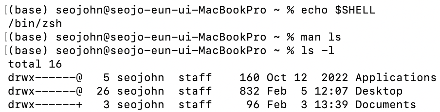
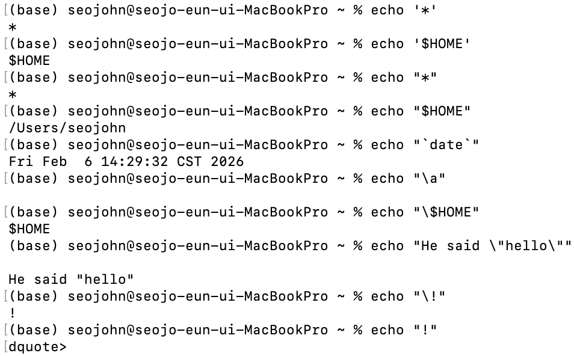
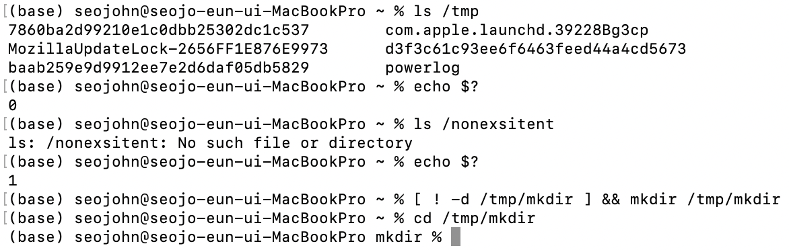
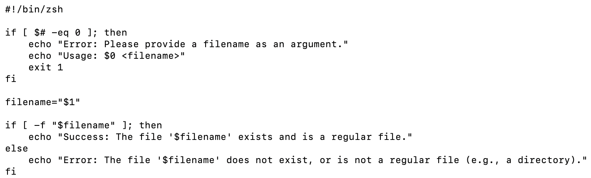
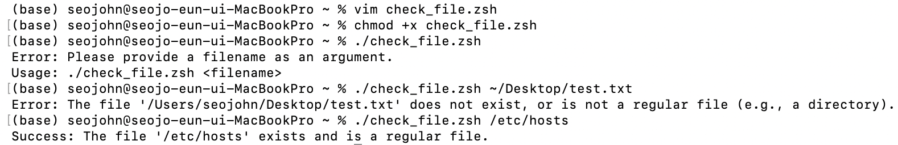
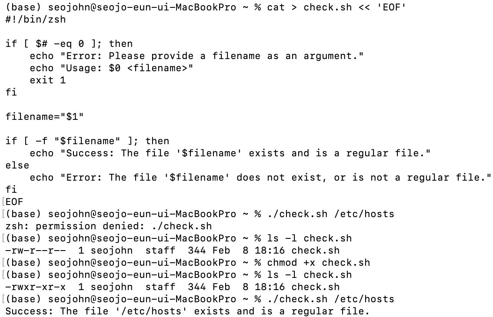
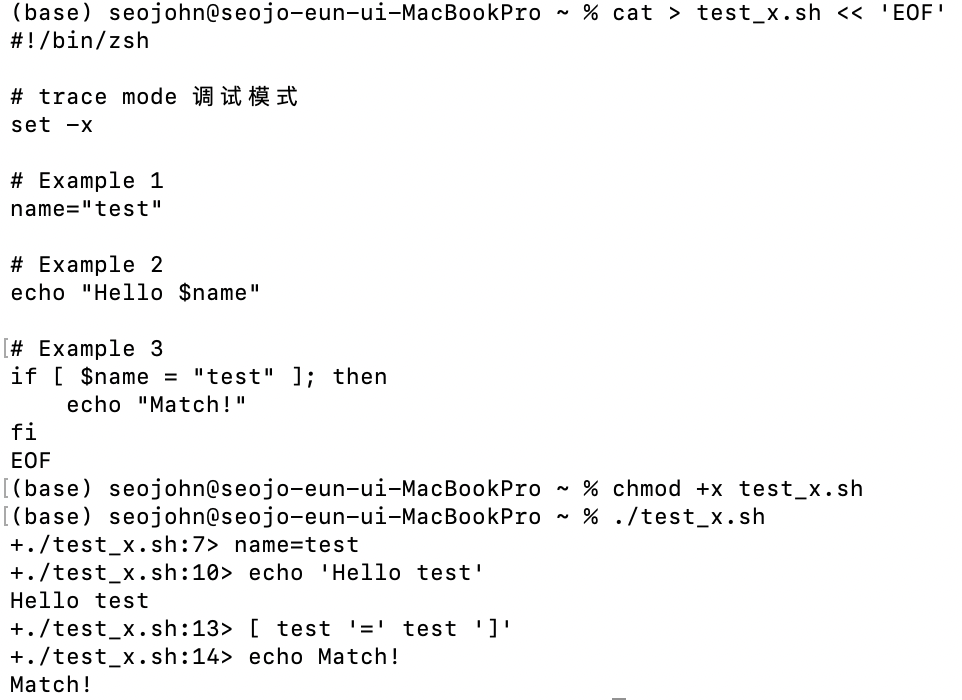
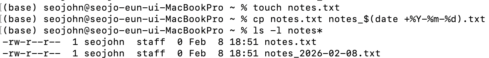
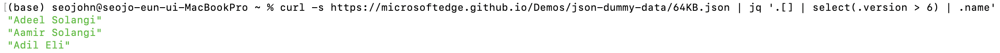
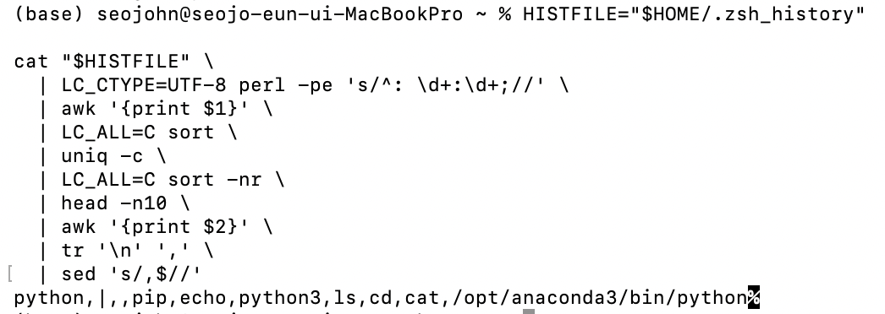

# Lecture 1_Introduction to the Shell
---
### 1. To make sure you’re running an appropriate shell, you can try the command `echo $SHELL`. 
### 2. What does the `-l` flag to `ls` do? Run `ls -l /` and examine the output. What do the first 10 characters of each line mean? (Hint: `man ls`)
<div align="center">

</div>

- `ls`: list directory contents. 列出当前目录内容
- `ls -l`: the long format 显示详细列表
    - file mode, number of links, owner name, group name, number of bytes in the file, abbreviated month, day-of-month file was last modified, hour file last modified, minute file last modified, and the pathname.
    - file mode: entry type + permissions.
    - entry type:  
        - `-`: Regular file.
        - `b`: Block special file.
        - `c`: Character special file.
        - `d`: Directory.
        - `l`: Symbolic link.
        - `p`: FIFO.
        - `s`: Socket.
        - `w`: Whiteout.
    - permissions
        1. `r` or `-`: the file is readable or not.
        2. `w` or `-`: the file is writable or not.
        3. third character
            - owner and group permissions
                - `S`: If in the owner permissions, the file is not executable and set-user-ID mode is set.  If in the group permissions, the file is not executable and set-group-ID mode is set.
                - `s`: If in the owner permissions, the file is executable and set-user-ID mode is set.  If in the group permissions, the file is executable and set-group-ID mode is set.
                - `x`: The file is executable or the directory is searchable.
                - `-`: The file is neither readable, writable, executable, nor set-user-ID nor set-group-ID mode, nor sticky.
            - other permissions
                - `T`: The sticky bit is set (mode 1000), but not execute or search permission.
                - `t`: The sticky bit is set (mode 1000), and is searchable or executable.

### 3. In the command `find ~/Downloads -type f -name "*.zip" -mtime +30`, the `*.zip` is a “glob”. What is a glob? Create a test directory with some files and experiment with patterns like `ls *.txt`, `ls file?.txt`, and `ls {a,b,c}.txt`. See [Pattern Matching](https://www.gnu.org/software/bash/manual/html_node/Pattern-Matching.html) in the Bash manual.
<div align="center">

</div>

- The command means "Find all ZIP files in your Downloads directory that were last modified more than 30 days ago".
- Glob: simpler patterns (than regular expression) that the shell (or programs like find) uses to match filenames. 更加便捷的用来查找符合特定规则的目录和文件的方法
- `*` matches any string, including the null string.
    ```
    ls *.zip
    ls file*
    ls **/*
    ls **/
    ```
- `?` matches any single character.
- `[...]` (bracket expression) matches a single character.
    ```
    ls file[0-9].txt
    ls report_[A-Z].pdf
    ls file[^0-9].txt 
    ls file[!0-9].txt
    ls file[[:digit:]].log
    ls [[:upper:]_][[:lower:]]*.txt
    ```
### 4. What’s the difference between `'single quotes'`, `"double quotes"`, and `$'ANSI quotes'`? Write a command that echoes a string containing a literal `$`, a `!`, and a newline character. See [Quoting](https://www.gnu.org/software/bash/manual/html_node/Quoting.html).
<div align="center">

</div>   

- Quoting: remove the special meaning.
- Escape Character(转义字符): A non-quoted backslash(反斜杠) ‘\’ is the Bash escape character. It preserves the literal value of the next character that follows, removing any special meaning it has, with the exception of newline(space, 换行符). If a \newline pair appears, and the backslash itself is not quoted, the \newline is treated as a line continuation(续行).
<div align="center">

</div>   

- Single Quotes: Enclosing characters in single quotes (‘'’) preserves the literal value of each character within the quotes. A single quote may not occur between single quotes, even when preceded by a backslash.
- Double Quotes: Enclosing characters in double quotes (‘"’) preserves the literal value of all characters within the quotes, with the exception of ‘$’, ‘`’, ‘\’, and, when history expansion is enabled, ‘!’. 
<div align="center">

</div>   

- ANSI-C Quoting: in the form of `$'string'`. The sequence expands to string, with backslash-escaped characters in string replaced as specified by the ANSI C standard.
<div align="center">

</div>   

### 5. The shell has three standard streams: stdin (0), stdout (1), and stderr (2). Run `ls /nonexistent /tmp` and redirect stdout to one file and stderr to another. How would you redirect both to the same file? See [Redirections](https://www.gnu.org/software/bash/manual/html_node/Redirections.html).
<div align="center">

</div>   

- Redirections(重定向)
    - ‘<’, the redirection refers to the standard input (file descriptor 0). 
    - ‘>’, the redirection refers to the standard output (file descriptor 1).
    - order: 
        - `ls > dirlist 2>&1` directs both standard output (file descriptor 1) and standard error (file descriptor 2) to the file dirlist.
        - `ls 2>&1 > dirlist` directs only the standard output to file dirlist, because the standard error was made a copy of the standard output before the standard output was redirected to dirlist.
<div align="center">

</div>   

### 6. `$?` holds the exit status of the last command (0 = success). `&&` runs the next command only if the previous succeeded; `||` runs it only if the previous failed. Write a one-liner that creates `/tmp/mydir` only if it doesn’t already exist. See [Exit Status](https://www.gnu.org/software/bash/manual/html_node/Exit-Status.html).
<div align="center">

</div>   

### 7. Why does `cd` have to be built into the shell itself rather than a standalone program? (Hint: think about what a child process can and cannot affect in its parent.)
- `cd` must be a builtin because child processes cannot modify the execution environment of their parent processes. 
- A standalone `cd` would run as a child process of the shell, only changing its own copied current working directory with no effect on the parent shell’s environment. 
- As a builtin, `cd` executes directly in the shell’s parent process, allowing it to modify the shell’s actual current working directory for the active session.

### 8. Write a script that takes a filename as an argument (`$1`) and checks whether the file exists using `test -f` or `[ -f ... ]`. It should print different messages depending on whether the file exists. See [Bash Conditional Expressions](https://www.gnu.org/software/bash/manual/html_node/Bash-Conditional-Expressions.html).
<div align="center">


</div>   

### 9. Save the script from the previous exercise to a file (e.g., check.sh). Try running it with ./check.sh somefile. What happens? Now run chmod +x check.sh and try again. Why is this step necessary? (Hint: look at ls -l check.sh before and after the chmod.)
<div align="center">

</div>   

- It can be seen from the result of `ls -l` that after running `chmod +x` (change mode), the owner's permissions change from `rw-` to `rwx`, group and other permissions change from `r--` to `r-x`, where `x` means the file is executable or the directory is searchable, as learned in Question 2 and from `man ls`.
### 10. What happens if you add `-x` to the `set` flags in a script? Try it with a simple script and observe the output. See The [Set Builtin](https://www.gnu.org/software/bash/manual/html_node/The-Set-Builtin.html).
<div align="center">

</div>   

- `set` prints the script's execution process (line-by-line commands) for script debugging.
### 11. Write a command that copies a file to a backup with today’s date in the filename (e.g.,  `notes.txt` → `notes_2026-01-12.txt)`. (Hint: `$(date +%Y-%m-%d)`). See [Command Substitution](https://www.gnu.org/software/bash/manual/html_node/Command-Substitution.html).
<div align="center">

</div>   

### 12. Modify the flaky test script from the lecture to accept the test command as an argument instead of hardcoding `cargo test my_test`. (Hint: `$1` or `$@`). See [Special Parameters](https://www.gnu.org/software/bash/manual/html_node/Special-Parameters.html).
- Due to issues encountered while installing stress via Homebrew, the corresponding section (#) related to the flaky test is presented as follows.
<div align="center">


</div>   

### 13. Use pipes to find the 5 most common file extensions in your home directory. (Hint: combine `find`, `grep` or `sed` or `awk`, `sort`, `uniq -c`, and `head`.)
- Due to the excessive length of the output, only the input and the final output are shown here.
  - Input: `find ~ -type f | awk -F. '{print $NF}' | sort | uniq -c | sort -nr | head -5`
    - `awk`, where the period character is specified as the field separator (`-F.`) so that each file path is split at **dots**, and the **last field** (`$NF`) is extracted as the file extension. These extensions are sorted **alphabetically** using `sort`, which is required before aggregation. The `uniq -c` command then **groups** identical extensions and **counts** their occurrences. The results are subsequently sorted numerically in **descending** order using `sort -nr`, ensuring that the most frequent extensions appear first. Finally, `head -5` limits the output to the five most common file extensions.
  - Final Output: 
    ```
    95811 py
    78632 pyc
    34450 h
    20873 pyi
    18024 js
    ```
- A `pipeline` is a sequence of one or more commands separated by one of the control operators `‘|’` or `‘|&’`. The output of each command in the pipeline is connected via a pipe to the input of the next command. That is, each command reads the previous command’s output. ([Pipelines](https://www.gnu.org/software/bash/manual/html_node/Pipelines.html))

### 14. `xargs` converts lines from stdin into command arguments. Use `find` and `xargs` together (not `find -exec`) to find all `.sh` files in a directory and count the lines in each with `wc -l`. Bonus: make it handle filenames with spaces. (Hint: `-print0` and `-0`). See `man xargs`.

-  `-0`: Change `xargs` to expect NUL characters as separators, instead of spaces and newlines. This is expected to be used in concert with the `-print0` function in find(1). (from `man xargs`)
-  Correct Solution should be `find . -name "*.sh" -print0 | xargs -0 wc -l`

### 15. Use `curl` to fetch the HTML of the course website (https://missing.csail.mit.edu/) and pipe it to `grep` to count how many lectures are listed. (Hint: look for a pattern that appears once per lecture; use `curl -s` to silence the progress output.)

<div align="center">

</div>   

- `curl` (Client URL) is a command-line tool used to fetch data from a URL, such as downloading a web page’s HTML.
- `grep` (`g / regular expression / p`) is a tool that searches text and filters lines that match a given pattern.
- When counting lectures from the course website, a simple match on `href="/2026/"` is insufficient because the navigation bar also contains a link to `href="/2026/"`, which is not a lecture. To avoid this extra match, the pattern is refined to only count links whose paths extend beyond `/2026/`, as each actual lecture page has a unique subpath under `/2026/`. 
- `[^"]*` means “match any characters except a double quote,” which safely consumes the URL without crossing its boundary. The trailing `/"` is added to ensure that the match ends at the closing quote of the URL and that the path is complete.
  
### 16. `jq` is a powerful tool for processing JSON data. Fetch the sample data at https://microsoftedge.github.io/Demos/json-dummy-data/64KB.json with `curl` and use `jq` to extract just the names of people whose version is greater than 6. (Hint: pipe to `jq .` first to see the structure; then try `jq '.[] | select(...) | .name'`)
<div align="center">


</div>   


### 17. `awk` can filter lines based on column values and manipulate output. For example, `awk '$3 ~ /pattern/ {$4=""; print}'` prints only lines where the third column matches `pattern`, while omitting the fourth column. Write an `awk` command that prints only lines where the second column is greater than 100, and swaps the first and third columns. Test with: `printf 'a 50 x\nb 150 y\nc 200 z\n'`
<div align="center">

</div>   

- `printf`: print formatted
  
### 18. Dissect the SSH log pipeline from the lecture: what does each step do? Then build something similar to find your most-used shell commands `from ~/.bash_history` (or `~/.zsh_history`).

```
missing:~$ ssh myserver 'journalctl -u sshd -b-1 | grep "Disconnected from"' \
  | sed -E 's/.*Disconnected from .* user (.*) [^ ]+ port.*/\1/' \
  | sort | uniq -c \
  | sort -nk1,1 | tail -n10 \
  | awk '{print $2}' | paste -sd,
postgres,mysql,oracle,dell,ubuntu,inspur,test,admin,user,root
```
- This command first connects via `SSH` to the remote host `myserver` and runs `journalctl -u sshd -b-1 | grep "Disconnected from"` on that host, where `journalctl` reads the systemd logs, `-u sshd` filters only the SSH daemon service, and `-b-1` limits it to the previous boot, while `grep "Disconnected from"` selects only the lines containing SSH disconnection messages. 
- The output is then piped into `sed -E 's/.*Disconnected from .* user (.*) [^ ]+ port.*/\1/'` which uses a regular expression to extract just the username from each line. 
- Next, `sort` alphabetically arranges the usernames so that identical names are grouped together, and `uniq -c` counts how many times each username appears. 
- After that, `sort -nk1,1 | tail -n10` sorts the counts numerically and selects the top ten entries by frequency. 
- Then `awk '{print $2}'` extracts only the second column, which is the username, removing the count, and finally `paste -sd`, combines all these usernames into a single comma-separated line, producing a concise list of the most frequent SSH users.
<div align="center">

</div>   