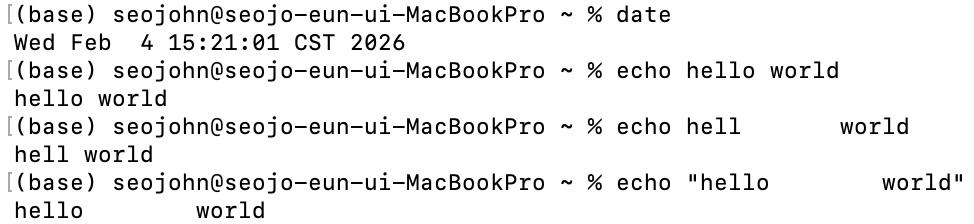
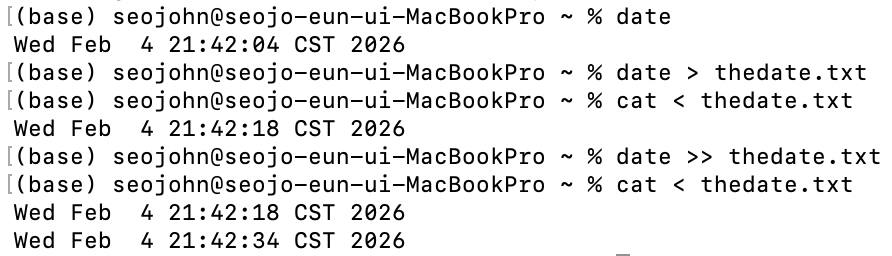

# Lecture 1_Introduction to the Shell
---
## What is the Shell
- a textual interface: shell
- To open a shell prompt (where you can type commands), you first need a terminal, which is the visual interface to a shell. MacOS: Press `Cmd + Space` to open Spotlight, type “Terminal”, and press Enter. Or find it in Applications → Utilities → Terminal.
- Bourne Again SHell, or “bash”; zsh(bash compatible shell)
---
## Navigating in shell
- user name: current working directory 工作目录
- tilde ~: home directory 
- argument: 参数
- the `echo` program: simply prints out its arguments.
- argument parsing 解析: split it by whitespace, indicate them one by one 

- backslash \ : an escape character that says don't treat the next character as special, so in the case of argument parsing, backslash space means literal space, do not split on this, this isn't a word boundary, it's a literal space that's a part of an argument.

- `man` program: short for manual, **use `q` to exit**
- `--help`: a short version of manual page

- `cd`: change directory
- `.`: current directory
- `..`: parent directory(one level up)

- `cd ~`: back to home 
- `Tab`: 

---
## What is available in the shell?
- `$PATH`: an environment variable that lists which directories the shell should search for programs when it is given a command. `:` separated lists.

- `ls`: short for list
- `cat file`, which prints the contents of `file`.
- `sort file`, which prints out the lines of `file` in sorted order. 
- `uniq file`, which eliminates consecutive duplicate lines from `file`.
- `head file` and `tail file`, which respectively print the first and last few lines of `file`.
- There’s also `grep pattern file`, which finds lines matching `pattern` in `file`.
- `sed -i 's/pattern/replacement/g' file`
- `find`, which lets you find files (recursively) that match certain conditions.  
- `awk`: parse files, extract only certain parts of every record
---
## The shell language (bash)
- pipes(`|`): let you string together the output of one program with the input of another.
- redirects: 
  - `>file` lets you take the standard output of a program and write it to `file` instead of to your terminal. 
  -  `>>file` will append to `file` rather than overwrite it. 
  -  `<file` tells the shell to read from file instead of from your keyboard as the standard input to a program.

- conditionals
- loops (while, for)
  - `test, [`
