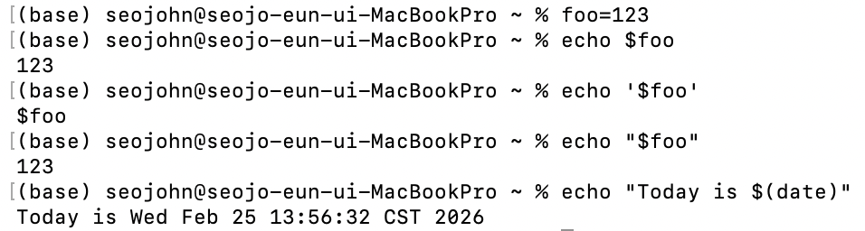

# Lecture 2_Command-line Environment
---
## The Command Line Interface (CLI) 命令行界面
### Arguments
- Arguments are plain strings in shell.
<div align="center">


</div>

- Most common globs
    - wildcards (通配符) `*` (zero or more of anything), `?` (exactly one of anything) and curly braces. Curly braces `{}` expand a comma-separated list of patterns into multiple arguments.
<div align="center">


</div>

### Streams
- When using the pipe operator `|`, the shell operates on streams of data that flow from one program to the next in the chain. We can demonstrate this concurrency, all commands in a pipeline start immediately:
<div align="center">

</div>

- redirection
<div align="center">

</div>

- `fzf` (fuzzy finder)
<div align="center">

</div>

### Environment variables
<div align="center">

</div>

- Command Substitution (命令替换)
```bash
% files=$(ls)            
% echo $files | grep "missing"
missing-semester
```
- Process Substitution (进程替换)
- TZ (time zone)
```bash
% date              
Wed Feb 25 14:20:07 CST 2026
% TZ=Asia/Seoul date
Wed Feb 25 15:20:08 KST 2026
```
### Return codes
- `echo $?` access the return code of the last command
- Boolean operators `&&` and `||`: conditionally run commands based on the success or failure of previous commands, where success is determined based on whether the return code is zero or not. (same as `if` and `while` statements)
   
### Signals
- killing a program: `^C` `Ctrl-C` `SIGINT` or `^\` `Ctrl-\` `SIGQUIT`
- `SIGSTOP` pauses a process. In the terminal, typing `Ctrl-Z` will prompt the shell to send a `SIGTSTP` signal, short for Terminal Stop.
