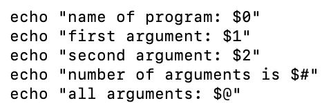
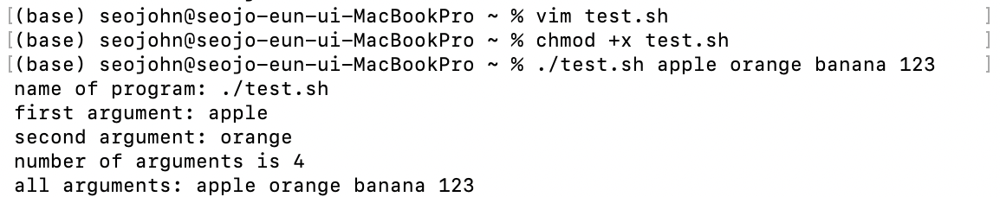
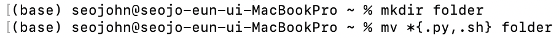
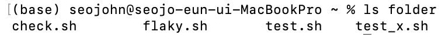
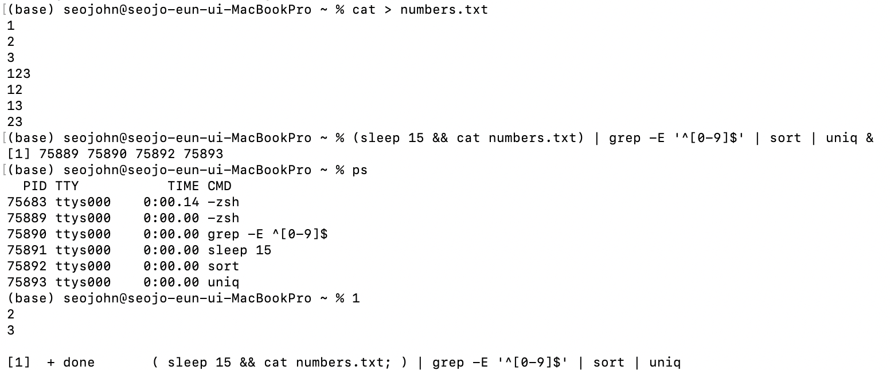
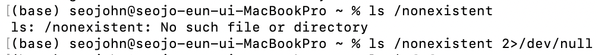
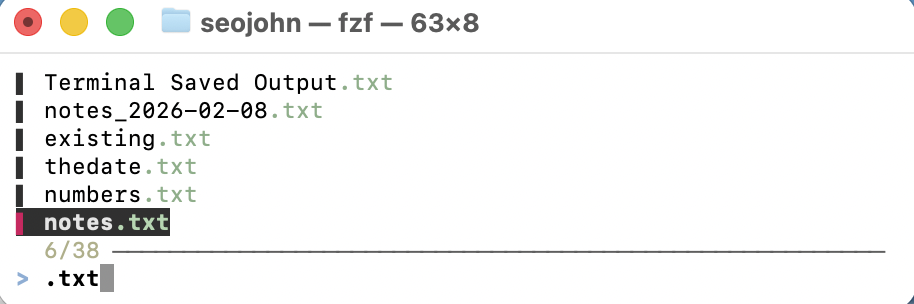

# Lecture 2_Command-line Environment
---
## The Command Line Interface (CLI) 命令行界面
### Arguments 参数
- Arguments are plain strings in shell.

- Most common globs
    - wildcards (通配符) `*` (zero or more of anything), `?` (exactly one of anything) and curly braces. Curly braces `{}` expand a comma-separated list of patterns into multiple arguments.

### Streams
- When using the pipe operator `|`, the shell operates on streams of data that flow from one program to the next in the chain. We can demonstrate this concurrency, all commands in a pipeline start immediately:

- redirection

- `fzf` (fuzzy finder)

### Environment variables

### Return codes
### Signals
---